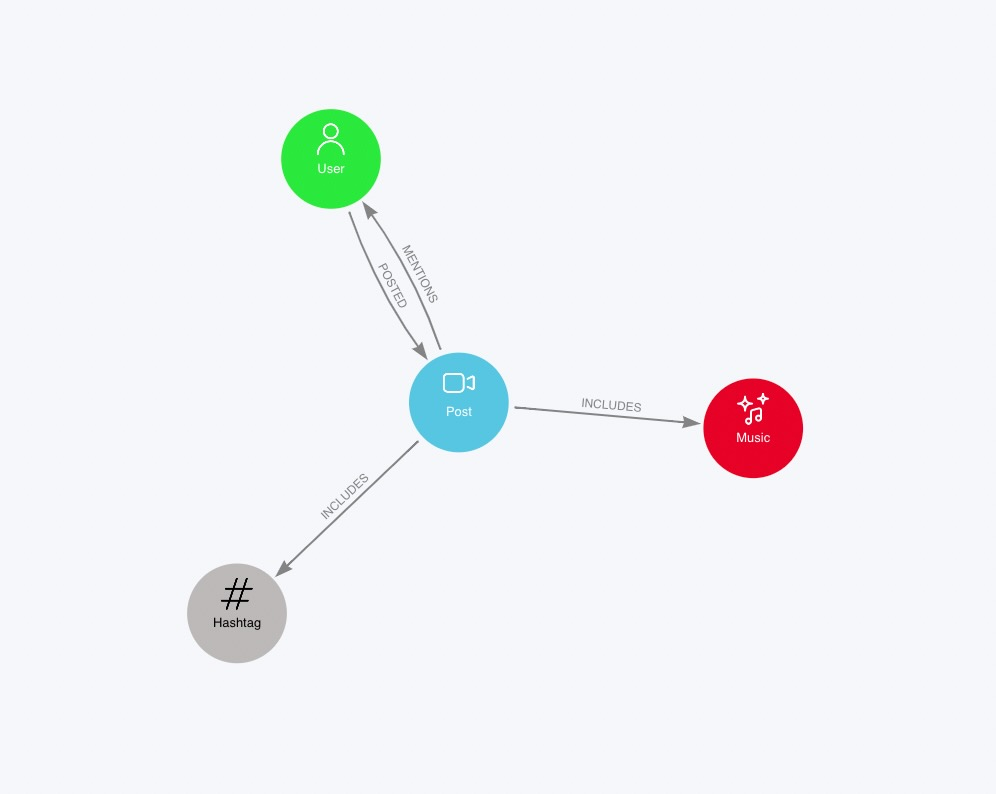

# Scitok : Web Scraping TikTok Data for Social Science Research

## Project Description

This project is the main outcome of a bachelor's thesis in computer science. The tool takes publicly available links from TikTok as an input argument and recursively follows public videos, music, hashtags, and user pages to collect data from these pages. The collected data is then stored in a [Neo4j](https://neo4j.com) graph database. For data analysis, it is recommended to use the [GraphXR](https://www.kineviz.com) application, which can be easily integrated into the Neo4j desktop app. If you are interested I would be happy if you have a look at my [thesis](https://www.researchgate.net/publication/368575971_Expose_Bachelor_Thesis_for_a_Degree_in_Computer_Science_Let%27s_Talk_about_TikTok_-_A_Webscraping_Tool_for_Social_Science_Research) and/or reach out. 

## Installation & Configuration

Running Scitok is simple with Docker. If Docker is not already installed on your machine, you can download it [here](https://www.docker.com/products/docker-desktop/). Before starting Scitok, follow these configuration steps:

1. Clone this repository.
2. Create a new file named .env in the root directory of the cloned repository.
3. Add the following content to the .env file:

```
#neo4j
NEO4J_AUTH=neo4j/<password>
DB_HOST=neo_db
```
Ensure to replace <password> with your chosen password.

After this step with Docker running, you can start Scitok by executing the following command. Be sure to replace <https://www.tiktok.com/tag/example> with the TikTok URL you wish to initiate the scraping process with:
```
MY_STARTURL="<https://www.tiktok.com/tag/example>" docker-compose up  
```

Next, navigate to http://localhost:7474 in your preferred web browser or even through the Neo4j Browser. The authentication details specified in the .env file can be used to access the data. For a brief introduction on how to use a Neo4j database, refer to this guide. To confirm if everything is working, execute the following in one of the input fields:

```
Match(n) return(n)
```
You can stop the scrape by pressing 'control+c' on your keybord and you can just start the database by running:
```
docker-compose up neo
```


## How to use SciTok
Scitok is especially designed for the purpose of social science research. Since network analysis is a growing field and especially fits to the analysis of social media the data is broad into the form of a graph of the following form:



This allows macro analysis of discourses on TikTok and insides throught the analysis of TikTok discourses from the macroperspective. GraphXR is an especially usefull tool to visualy explore the graph and to apply graph algorithms to the data.

## License 
Shield: [![CC BY-NC-SA 4.0][cc-by-nc-sa-shield]][cc-by-nc-sa]

This work is licensed under a
[Creative Commons Attribution-NonCommercial-ShareAlike 4.0 International License][cc-by-nc-sa].

[![CC BY-NC-SA 4.0][cc-by-nc-sa-image]][cc-by-nc-sa]

[cc-by-nc-sa]: http://creativecommons.org/licenses/by-nc-sa/4.0/
[cc-by-nc-sa-image]: https://licensebuttons.net/l/by-nc-sa/4.0/88x31.png
[cc-by-nc-sa-shield]: https://img.shields.io/badge/License-CC%20BY--NC--SA%204.0-lightgrey.svg


